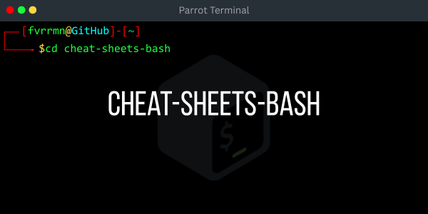

# cheat-sheets-bash
*Documentation d'apprentissage et de partage sur les commandes essentielles de Bash*

 
  
  
  
<em>Image protégée – Propriété exclusive</em>

## Introduction

Parce qu’un bon Administrateur Systèmes et Réseaux se doit de prendre des notes et documenter ce qu’il apprend, cette ressource rassemble des fiches mémo Bash permettant de retrouver rapidement les commandes essentielles sans avoir à les rechercher à chaque fois. Ces fiches sont conçues pour l’apprentissage, la révision et le partage, et facilitent la maîtrise du terminal Linux pour débutants.

⚠️ Il ne s’agit pas d’un tutoriel complet sur Bash, mais uniquement de rappels et fiches mémo des commandes essentielles.

## Sommaire

1. [Basic Commands](#basic_commands)
2. [Text Processing](#text_processing)
3. [System Monitoring](#system_monitoring)
4. [Networking](#networking)
5. [File Compression](#file_compression)
6. [File Permissions](#file_permissions)

## 1. Basic Commands
Rappels des commandes pour naviguer et gérer les fichiers et dossiers.
[Voir le fichier Basic_Commands.txt](./Commandes_Bash/Basic_Commands.txt)

## 2. Text Processing
Rappels des commandes pour manipuler et traiter du texte.
[Voir le fichier Text_Processing.txt](./Commandes_Bash/Text_Processing.txt)

## 3. System Monitoring
Rappels des commandes pour surveiller l’état et les performances du système.
[Voir le fichier System_Monitoring.txt](./Commandes_Bash/System_Monitoring.txt)

## 4. Networking
Rappels des commandes pour gérer et tester les connexions réseau depuis Bash.
[Voir le fichier Networking.txt](./Commandes_Bash/Networking.txt)

## 5. File Compression
Rappels des commandes pour compresser, décompresser et gérer les archives de fichiers.
[Voir le fichier File_Compression.txt](./Commandes_Bash/File_Compression.txt)

## 6. File Permissions
Rappels des commandes pour gérer les droits et permissions des fichiers et dossiers.
[Voir le fichier File_Permissions.txt](./Commandes_Bash/File_Permissions.txt)

